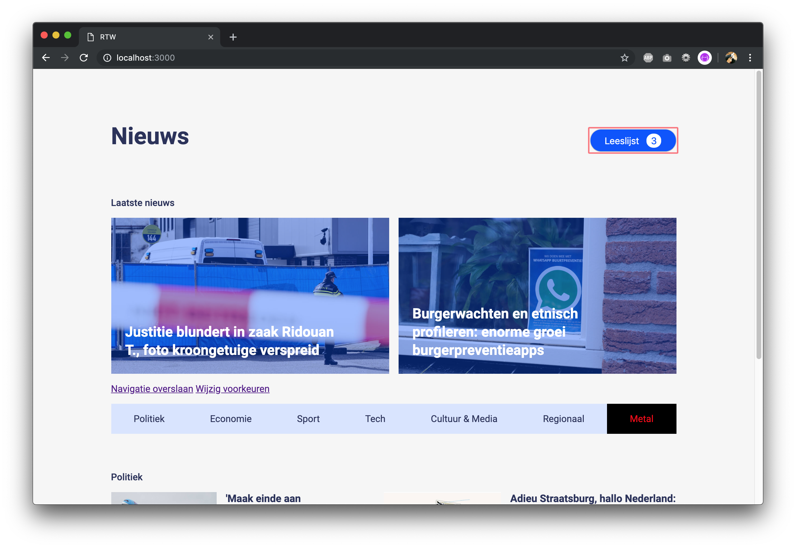

🎓 Web Design @cmda-minor-web · 2018-2019

# Een toegankelijke nieuws website voor Marijn

Dit is een nieuws website speciaal toegankelijk voor Marijn. Marijn is motorisch gestoord. Hij gebruikt zijn computer dus anders dan wij. Hij heeft veel moeite met fijne motoriek.

<!-- ### Onderzoek -->

<!-- [Xbox Adaptive Controller](https://www.behance.net/gallery/77277575/Xbox-Adaptive-Controller-Microsoft-Device-Design-Team?tracking_source=search%257Caccessibility)

[Pharmaceutical Packaging](https://www.behance.net/gallery/79121005/Recollaid-Pharmaceutical-Packaging?tracking_source=search%257Caccessibility)

[Custom eCommerce Website](https://www.behance.net/gallery/17913001/Custom-eCommerce-Website-JADF-(with-animated-GIFs?tracking_source=search%257Caccessibility) -->

### Test 1

**Aannames**

- Marijn gebruikt alleen zijn toetsenbord. Niet zijn trackpad.
- Marijn gebruikt de spatiebalk om te scrollen.
- Gebruikt stickey keys.

**Bevindingen**

Algemeen:

- `Tab` toets in Safari werkt niet zoals in meeste andere browsers.
- Marijn gebruikt zijn `Tab` key minder dan ik had verwacht.
- Marijn gebruikt wél zijn trackpad.
- Marijn gebruikt het liefst toetsen dicht bij elkaar.
- Voor Marijn is het lastiger om het bovenste gedeelte van zijn toetsenbord te gebruiken.
- Marijn gebruikt liefst zo min mogelijk toetsen om eindresultaat te bereiken (soms zijn spaties bijvoorbeeld overbodig).

test

**Vraag 1: Wil je voor mij een artikel gaan lezen wat je het meest aanspreekt?**

**Resultaat**: Marijn klikte met zijn muis een artikel (redelijk onderaan de pagina aan).

**Vraag 2: Kun je weer terug gaan naar de overzichtspagina?**
**Resultaat**: Dat gebeurde zo snel dat ik in eerste instantie niet door had hoe hij dit deed. Maar hij legde mij uit dat hij dit met zijn touchbar doet.

**Vraag 3: Wil je voor mij de voorkeuren van de navigatie veranderen?**

Hij klikte het linkje wijzig voorkeuren aan met zijn muis (wat ik niet had verwacht). Daarna wilde hij met zijn muis onderdelen van de navigatie verwijderen. Maar omdat ik ervanuit was gegaan dat hij zijn trackpad niet gebruikte was dit linkje niet klikbaar. Met de toetsen lukte het uiteindelijk ook.

**Vraag 4: Stel dat je nu tevreden zou zijn, wat zou je doen?**

Marijn raakte met zijn muis het knopje gereed. (Deed daarna niks).

Aanpassingen na deze test:

- Aangezien Marijn meer zijn muis gebruikt, minder de tab gebruikt dan verwacht en het liefst toetsen dicht bij elkaar gebruikt heb ik ervoor gezorgd dat hij de website ook kan besturen met zijn pijltjestoetsen (i.s.m.) met de enter dichtbij. Hierbij heb ik een autofocus toegevoegd aan de button.
- Het aanpassen van de navigatie kan ook met de muis.

### Test 2

**Vraag 1: Wil je voor nog een keer de voorkeuren van de navigatie veranderen?**

Marijn navigeerd, in tegenstelling met vorige test, met de pijltjes toetsen. Het verplaatsen van de onderwerpen lukte net als vorige keer. Dit deed hij in tegenstelling tot vorige keer ook met zijn toetsenbord.
Hij probeerde ook met zijn pijltjestoetsen de navigatie aan te passen.

**Vraag 2: Stel dat je nu tevreden zou zijn, wat zou je doen?**

Hij zei: dan zou ik op gereed drukken (hij probeerde dit ook met zijn muis), maar dat knopje is te klein... Hij lukte hem inderdaad niet de knop in te drukken.

Volgende aanpassingen na deze test:

- Gereed knop groter.
- Navigatie ook met pijltjestoeten toegankelijk.
